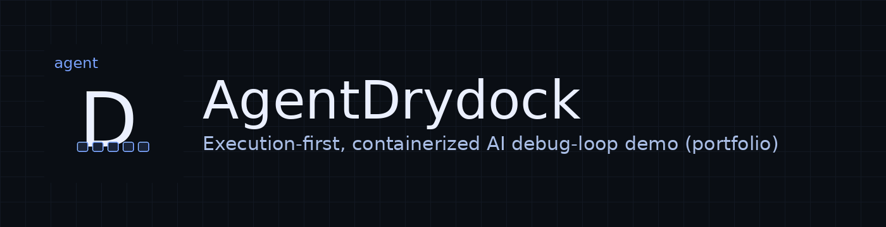
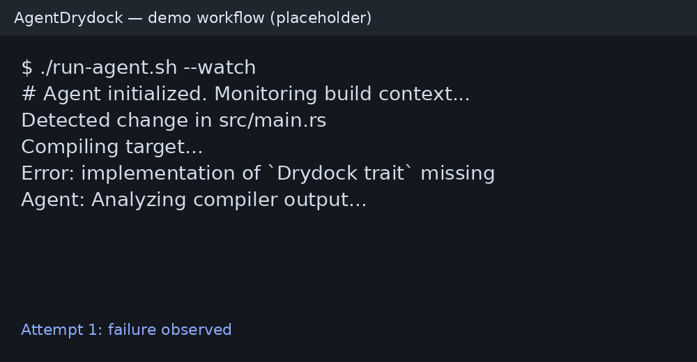
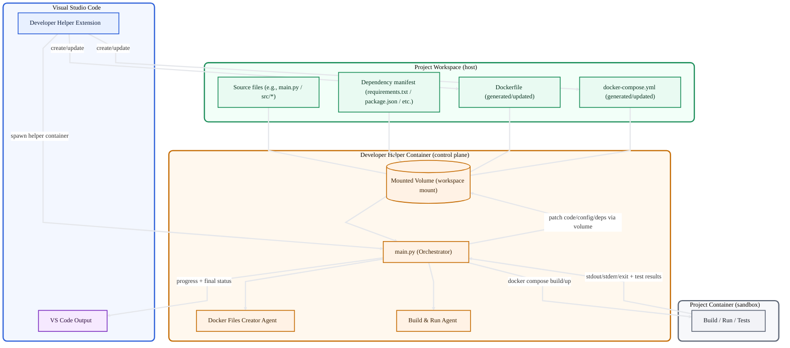
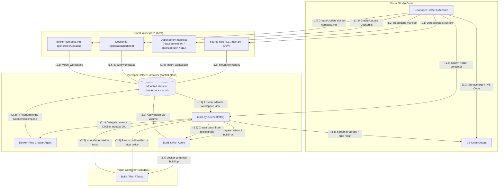
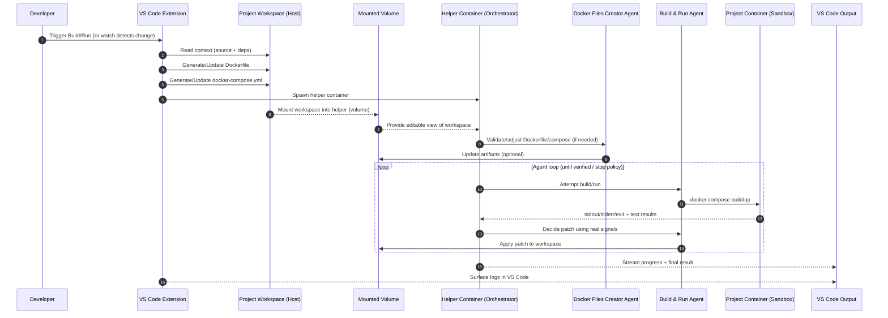

<!-- PROJECT BANNER -->
<p align="center">
  
</p>

<h1 align="center">AgentDrydock — Demo / Portfolio Showcase</h1>

<p align="center">
  <strong>Agentic AI & Coding Assistant for Containerized Build/Run Fix Loops</strong><br/>
  A personal demo prototype exploring execution-first automation for the debug loop:
  <code>edit → build → run → fail → fix</code>
</p>

<p align="center">
  <a href="https://www.agentdrydock.com/">Website</a> •
  <a href="#demo">Demo</a> •
  <a href="#how-it-works">How it Works</a> •
  <a href="#architecture">Architecture</a> •
  <a href="#roadmap">Roadmap</a> •
  <a href="#disclaimer">Disclaimer</a>
</p>

<p align="center">
  
  
  
  
</p>

> **This repository is a public showcase** (docs, diagrams, video links).  
> **Not a commercial product.** No SLA. No paid support. Use at your own risk.

---

## Table of Contents
- [What is AgentDrydock?](#what-is-agentdrydock)
- [Demo](#demo)
- [Why Execution-First?](#why-execution-first)
- [How it Works](#how-it-works)
- [Architecture](#architecture)
  - [Conceptual Flow](#conceptual-flow)
  - [Step-by-Step Conceptual Flow](#step-by-step-conceptual-flow)
  - [Sequence Diagram](#sequence-diagram)
- [Why Containers?](#why-containers)
- [Use Cases](#use-cases)
- [Non-goals](#non-goals)
- [Roadmap](#roadmap)
- [Collaboration](#collaboration)
- [Legal](#legal)
- [Disclaimer](#disclaimer)

---

## What is AgentDrydock?

Many AI coding assistants can propose fixes, but without executing the code they can:
- hallucinate libraries/APIs,
- miss environment-specific context,
- produce patches that don’t compile,
- fix one error while breaking tests.

**AgentDrydock’s core idea:**  
> Don’t guess. **Run in a real environment**, capture real failure signals, feed them back to the agent loop, and verify by re-running.

---

## Demo

🎥 **Demo video:** https://www.youtube.com/watch?v=2IbIenrjvfg  
🌐 **Website:** https://www.agentdrydock.com/  
✉️ **Contact:** taskma@gmail.com

<p align="center">
  
</p>

Example loop:

```bash
./run-agent.sh --watch
# Agent initialized. Monitoring build context...
Detected change in src/main.rs
Compiling target...
Error: implementation of `Drydock trait` missing
Agent: Analyzing compiler output...
Agent: Generating fix for impl block...
✓ Fix applied automatically
```

> Goal: faster iteration on repeat failures (often ~2–3×) — varies by codebase and failure type.

---

## Why Execution-First?

AI can “sound right” while being wrong. AgentDrydock forces grounding by using:
- real compiler output
- real test output
- real exit codes
- real runtime logs

The loop is guided by facts, not assumptions.

---

## How it Works

AgentDrydock is designed around a **VS Code-driven workflow** with a **helper container** coordinating the agent loop and a **project container** acting as the disposable execution sandbox.

1) **VS Code Extension prepares the run**
   - Generates/updates **Dockerfile** and **docker-compose.yml** for the current project context.
   - Triggers a run when you request “Build & Run” (or watch mode detects changes).

2) **Spawn Helper Container**
   - A dedicated **Developer Helper Container** is started.
   - The project workspace is mounted into the helper via a **volume** for safe, controlled edits.

3) **Run in Project Container (Sandbox)**
   - The helper uses the generated compose config to build and run the **Project Container**.

4) **Observe real signals**
   - Collects **stdout/stderr**, exit codes, and (optionally) test output.

5) **Agent loop: patch → re-run → verify**
   - A “Docker Files Creator” agent (when needed) adjusts container configs.
   - A “Build & Run” agent proposes code/config changes based on real failures.
   - The helper writes patches back through the mounted volume and re-runs until verified.

6) **Report to VS Code Output**
   - The extension streams progress and final results to **VS Code Output**.

---

## Architecture

This section includes diagrams that render on GitHub using Mermaid code blocks.

### Conceptual Flow



### Step-by-Step Conceptual Flow



### Sequence Diagram

> This diagram shows the same flow with a time-ordered view (who calls whom, and when).



---

## Why Containers?

Traditional agents run in your local shell (risky + messy). Containers provide:
- **Isolation** — no host pollution or global config drift
- **Reproducibility** — consistent environment per attempt
- **Control** — resource limits + deterministic snapshots

---

## Use Cases
- **Missing Dependencies** — install missing system libs / language packages
- **Config Mismatches** — resolve env var conflicts (local vs CI/CD)
- **Refactoring Regressions** — fix broken tests after changes
- **Version Conflicts** — experiment with dependency matrices in isolation

---

## Non-goals
To keep this a safe, honest demo artifact:
- No claims of production readiness, SLA, or paid support
- No proprietary or customer code
- No “magic fixes” without verification
- Demo videos may contain randomly generated code

---

## Roadmap
- [ ] Smarter Docker artifact generation (language/runtime templates)
- [ ] Pluggable “run profiles” (build-only, test-only, full pipeline)
- [ ] Richer signal packs (test reports, traces, structured logs)
- [ ] Reviewer gates (agent proposes → reviewer approves → verify)
- [ ] Capability sandbox (allowed commands / restricted operations)
- [ ] Deterministic caching while preserving isolation

---

## Collaboration
This is a portfolio/demo artifact exploring a vision for developer tooling.

✅ Suggestions welcome:
- architecture reviews
- nasty failure scenarios to test
- UX feedback on the workflow

Contact: taskma@gmail.com

---

## Legal
- Demo terms: `legal/demo-terms.md`
- Privacy: `legal/privacy.md`

---

## Disclaimer
AgentDrydock is a personal technical project and portfolio/demo artifact.
All code runs in isolated containers, but **use at your own risk**.
No commercial offering. No SLA. No paid support.

© 2025 Agent Drydock. All rights reserved.
