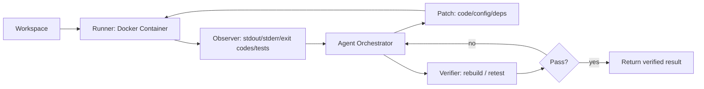

<!-- PROJECT BANNER -->
<p align="center">
  
</p>

<h1 align="center">AgentDrydock — Demo / Portfolio Showcase</h1>

<p align="center">
  <strong>Agentic AI & Coding Assistant for Containerized Build/Run Fix Loops</strong><br/>
  A personal demo prototype exploring execution-first automation for the debug loop:
  <code>edit → build → run → fail → fix</code>
</p>

<p align="center">
  <a href="https://www.agentdrydock.com/">Website</a> •
  <a href="#demo">Demo</a> •
  <a href="#architecture">Architecture</a> •
  <a href="#roadmap">Roadmap</a> •
  <a href="#disclaimer">Disclaimer</a>
</p>

<p align="center">
  
  
  
  
</p>

> **This repository is a public showcase** (docs, diagrams, video links).  
> **Not a commercial product.** No SLA. No paid support. Use at your own risk.

---

## Table of Contents
- [What is AgentDrydock?](#what-is-agentdrydock)
- [Why Execution-First?](#why-execution-first)
- [Demo](#demo)
- [How it Works](#how-it-works)
- [Architecture](#architecture)
- [Why Containers?](#why-containers)
- [Use Cases](#use-cases)
- [Non-goals](#non-goals)
- [Roadmap](#roadmap)
- [Collaboration](#collaboration)
- [Legal](#legal)
- [Disclaimer](#disclaimer)

---

## What is AgentDrydock?

Many AI coding assistants can propose fixes, but without executing the code they can:
- hallucinate libraries/APIs,
- miss environment-specific context,
- produce patches that don’t compile,
- fix one error while breaking tests.

**AgentDrydock’s core idea:**  
> Don’t guess. **Run in a real environment**, capture real failure signals, feed them back to the agent loop, and verify by re-running.

---

## Why Execution-First?

AI can “sound right” while being wrong. AgentDrydock forces grounding by using:
- real compiler output
- real test output
- real exit codes
- real runtime logs

The loop is guided by facts, not assumptions.

---

## Demo

🎥 **Demo video:** https://www.youtube.com/watch?v=2IbIenrjvfg  
📓 **Walkthrough notes:** `docs/demo-notes.md`  
✉️ **Contact:** taskma@gmail.com

<p align="center">
  
</p>

Example flow:

```bash
./run-agent.sh --watch
# Agent initialized. Monitoring build context...
Detected change in src/main.rs
Compiling target...
Error: implementation of `Drydock trait` missing
Agent: Analyzing compiler output...
Agent: Generating fix for impl block...
✓ Fix applied automatically
```

> Goal: faster iteration on repeat failures (often ~2–3×) — varies by codebase and failure type.

---

## How it Works

1) **Run in Container**  
   Execute the project in a disposable Docker container.

2) **Observe Real Signals**  
   Capture `stdout`, `stderr`, exit codes, and test outputs (when applicable).

3) **Fix with Agent Loop**  
   Analyze the failure, patch code/config/deps, then re-run.

4) **Verify & Clean Result**  
   Once passing, discard the container and keep only the verified result.

---

## Architecture

📌 Full notes: `docs/architecture.md`

### Conceptual components
- **Runner**: creates & manages disposable containers
- **Observer**: collects compiler/test/log signals
- **Snapshot/Diff**: filesystem state before/after attempts
- **Orchestrator**: decides next action (patch code, change deps, update config)
- **Verifier**: re-runs build/tests to confirm success

### Diagram (Mermaid)



### Multi-model orchestration (optional exploration)
Parallel agents (Claude / GPT / Gemini etc.) can:
- propose + review fixes,
- cross-check edge cases,
- converge on higher-confidence patches,
- still **must** pass verification.

---

## Why Containers?

Traditional agents run in your local shell (risky + messy). Containers provide:

- **Isolation** — no host pollution or global config drift  
- **Reproducibility** — consistent environment per attempt  
- **Control** — resource limits + deterministic snapshots  

---

## Use Cases
- **Missing Dependencies** — install missing system libs / language packages
- **Config Mismatches** — resolve env var conflicts (local vs CI/CD)
- **Refactoring Regressions** — fix broken tests after changes
- **Version Conflicts** — experiment with dependency matrices in isolation

---

## Non-goals
To keep this a safe, honest demo artifact:
- No claims of production readiness, SLA, or paid support
- No proprietary or customer code
- No “magic fixes” without verification
- Demo videos may contain randomly generated code

---

## Roadmap
- [ ] Richer “signal packs” (test reports, traces, structured logs)
- [ ] Pluggable stop policy (timeouts, max attempts, confidence)
- [ ] Deterministic caching while preserving isolation
- [ ] Reviewer gates (agent proposes → reviewer approves → verify)
- [ ] Capability sandbox (allowed commands / restricted operations)

---

## Collaboration
This is a portfolio/demo artifact exploring a vision for developer tooling.

✅ Suggestions welcome:
- architecture reviews
- nasty failure scenarios to test
- UX feedback on the workflow

See `CONTRIBUTING.md`.

---

## Legal
- Demo terms: `legal/demo-terms.md`
- Privacy: `legal/privacy.md`

---

## Disclaimer
AgentDrydock is a personal technical project and portfolio/demo artifact.
All code runs in isolated containers, but **use at your own risk**.
No commercial offering. No SLA. No paid support.

© 2025 Agent Drydock. All rights reserved.
